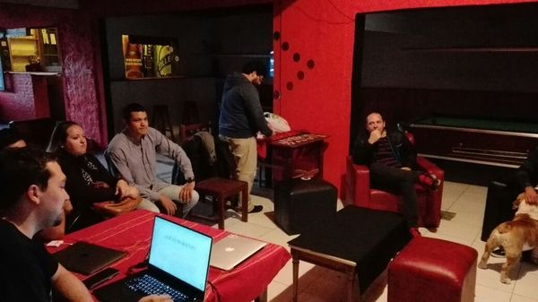

# Abril 2017

* Fecha: 29 de Abril del 2017
* Hora: 18:00 a 21:00 hrs
* Participantes: 8

## Actividades

* Introducción a React - Santiago Ferreira
* Introducción a Bootstrap - Julio Barrios

## Recursos

* [REACT Framework](https://facebook.github.io/react/)
* [Bootstrap CSS Framework](https://getbootstrap.com)

## Participantes

* Luis Ferreira ([@hidnasio](https://github.com/hidnasio))
* Santiago Ferreira ([@san650](https://github.com/san650))
* Julio Barrios ([@jubar](https://github.com/jubar))
* Gabriel Roldan ([@luisgabrielroldan](https://github.com/luisgabrielroldan))
* Yasser Núñez
* Jorge Luis Gonzales
* Paola Olivera
* Fernando Isasa
