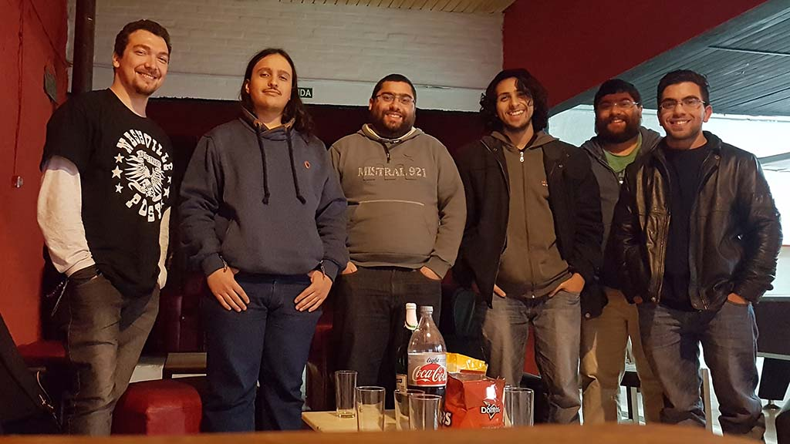

# Junio 2017

* Fecha: 3 de Junio del 2017
* Hora: 18:00 a 20:00 hrs
* Participantes: 6

## Actividades

* Elm - Andrés Rodríguez
* Saliendo del paso con Google Forms - Luis Ferreira

## Recursos

* [Elm Framework](http://elm-lang.org/)
* [Heroku platform](https://www.heroku.com)
* [Bootstrap CSS Framework](https://getbootstrap.com)
* [Python Simple Server](http://www.pythonforbeginners.com/modules-in-python/how-to-use-simplehttpserver/)
* [Git](https://git-scm.com/)

## Participantes

* Luis Ferreira ([@hidnasio](https://github.com/hidnasio))
* Santiago Ferreira ([@san650](https://github.com/san650))
* Gabriel Roldan ([@luisgabrielroldan](https://github.com/luisgabrielroldan))
* Andrés Rodríguez ([@mixedcase](https://github.com/mixedcase))

