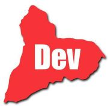

# Tacuarembó Desarrolla

Algunos links útiles:

* [Página en meetup.com](https://www.meetup.com/es-ES/tacuarembo-desarrolla/) donde puedes ver las próximas reuniones.
* [Organización de Github](https://github.com/tbo-desarrolla/) donde puedes encontrar los repos de las notas, el sitio y código de los workshops (entre otras cosas).
* [Nuestra comunidad en slack](http://owu.slack.com/), puedes encontrarnos en el canal #meetup-tbo-desarrolla. Para registrarte puedes ingresar a [owu.herokuapp.com](http://owu.herokuapp.com/). Para los curiosos OWU == Open Web Uruguay

## Notas de los meetups anteriores

### 2017

* [Abril](2017-04/README.md)
